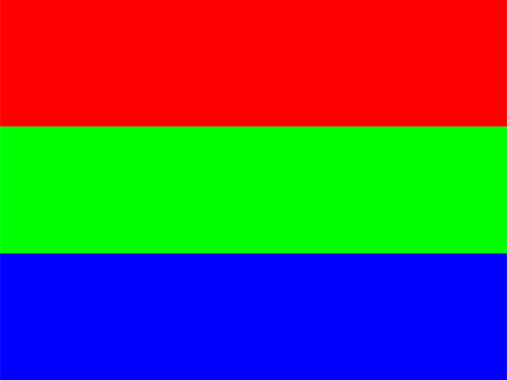
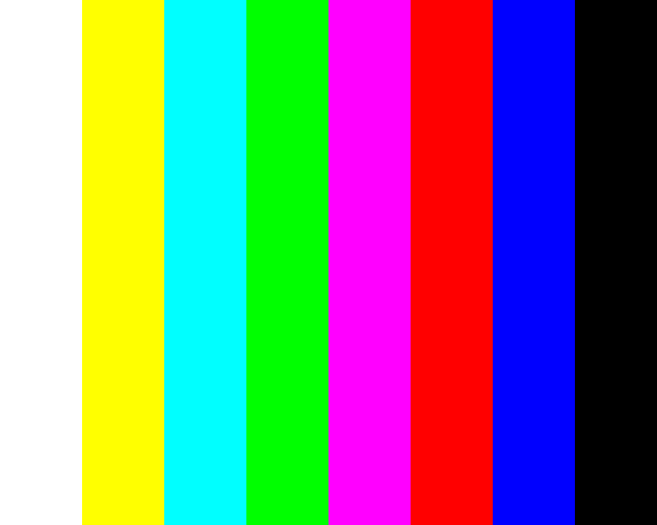
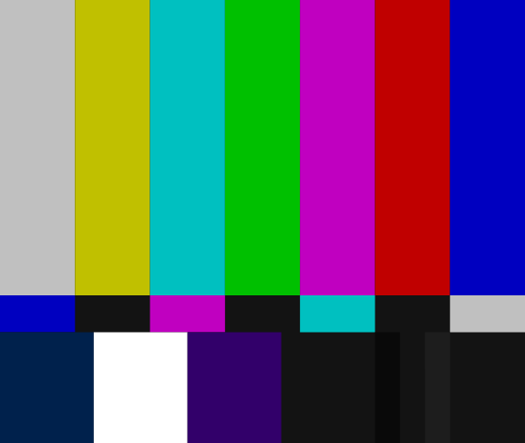
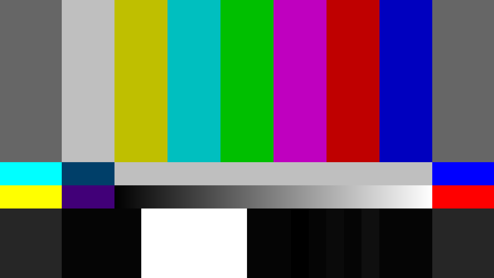

# `Responsive Test Cards`

Fully responsive test cards for Screen and Video drivers, made entirely with HTML + CSS + SVG. As they are standalone files, you can download and use them 100% offline, if you want. No analytics, no JS.

### Gallery

|  |  |
| :----------------------------------------------------------: | :----------------------------------------------------------: |
| [RGB Test Card](https://rawcdn.githack.com/gustavomdsantos/responsive-test-cards/refs/heads/main/RGB%20Test%20Card.html) | [EBU 100% Colour Bars](https://rawcdn.githack.com/gustavomdsantos/responsive-test-cards/refs/heads/main/EBU%20100%20Percent%20Colour%20Bars.html) |
|  |  |
| [SMPTE ECR 1-1978 Color Bars](https://rawcdn.githack.com/gustavomdsantos/responsive-test-cards/refs/heads/main/SMPTE%20Color%20Bars.html) | [SMPTE RP 219-2002 Color Bars](https://rawcdn.githack.com/gustavomdsantos/responsive-test-cards/refs/heads/main/SMPTE%20HD%20Color%20Bars.html) |

### Roadmap

- [ ] RCA TK-1C 'Indian Head' Test Card
- [ ] Telefunken FuBK Test Card
- [ ] Philips PM5544 Test Card
- [ ] BBC Test Card F
- [ ] GY/T 413-2024 Test Card

### To-do (if I have free time)

- [ ] Gus M.D.'s HDR Test Card
- [ ] Gus M.D.'s E-Ink Screen and Print Test Card
- [ ] Links Browser Test Card

### Inspirations

* [TV Test Card - CodePen](https://codepen.io/Airwavess/details/QWjLQJZ)
* [Video Test Patterns - Tools4Events](https://www.tools4events.net/video-test-patterns/)
* [FreeScreenTest](https://www.freescreentest.com)